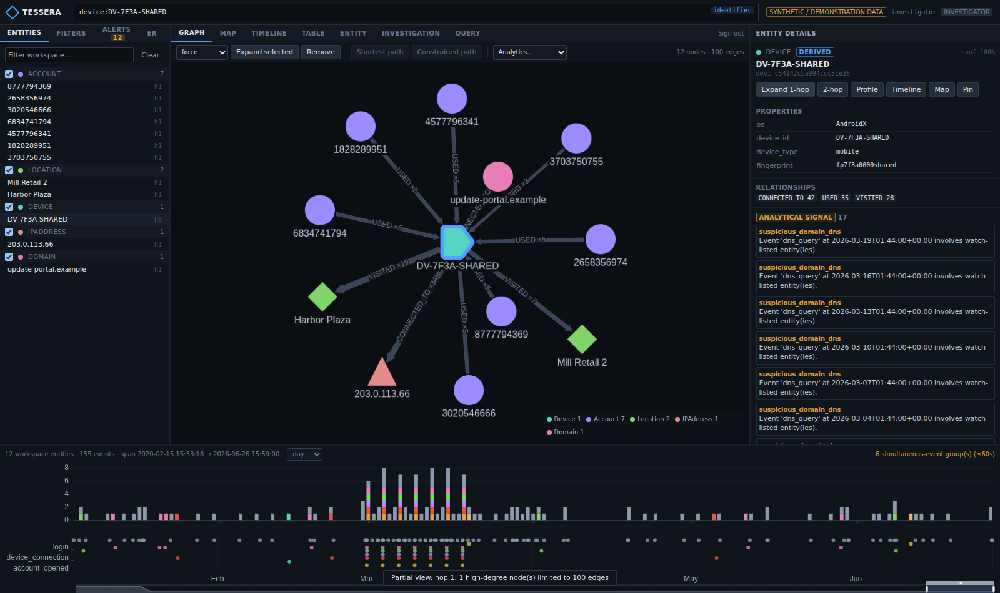

# Tessera — Investigative Intelligence Workbench

A local-first, open investigative-intelligence and decision-support platform: heterogeneous
data integration, deterministic entity resolution, a configurable ontology, a PostgreSQL/PostGIS
knowledge graph, graph / temporal / geospatial analysis, provenance and lineage for every
derived fact, collaborative investigations, deterministic rules and alerts, and explainable,
exportable reports.

It is an **original implementation** inspired by the general architectural ideas of
investigation platforms. It contains no proprietary code, assets, trademarks or APIs from any
vendor and makes no compatibility claims. It is **decision support**: it never states that a
person or organisation is guilty of anything — it surfaces *analytical signals* with evidence,
assumptions, uncertainty and alternative explanations.

```
Search → Inspect → Expand → Filter → Correlate → Investigate → Explain
```



## What's inside

| Area | Implementation |
|---|---|
| Ingestion | CSV · JSON · JSONL · Parquet · PostgreSQL · REST connectors → declarative, versioned mappings → RAW records with content hashes; idempotent re-ingestion with change detection |
| Ontology | 15 entity types, 22 relationship types, property types + sensitivity + identifier kinds — all in `data/schemas/ontology.json` |
| Entity resolution | normalisation, blocking, Jaro-Winkler, Levenshtein, token overlap, exact identifiers → `MATCH` / `POSSIBLE_MATCH` / `NO_MATCH` with evidence; reversible merges; analyst review |
| Knowledge graph | PostgreSQL adjacency with partial/composite indexes; windowed N-hop traversal with fan-out caps; shortest / all-simple / weighted / constrained paths; NetworkX analytics on bounded windows |
| Search | query language (exact, fuzzy, prefix, identifiers, types, properties, dates, radius, bbox) over pg_trgm + identifier index |
| Timeline | windows, buckets, per-type histograms, simultaneous-event grouping |
| Geospatial | PostGIS radius, polygon intersection, KNN, geofences, trajectories, heatmaps; **time × space × entity × relationship** queries |
| Provenance | lineage links for every entity/edge/event back to the raw record; "why does this exist?" for any object |
| Workspace | investigations with optimistic versioning, evidence board (entities, edges, events, signals, notes, citations, documents), hypotheses, saved queries, visual query builder with plans |
| Rules & alerts | deterministic threshold / unusual-count / cycle / event / sequence / geofence / new-relationship / source-change rules → ANALYTICAL SIGNALS → alerts over WebSocket |
| Security | bcrypt, lockout, JWT + revocable server sessions, RBAC (4 roles), field-level masking, append-only hash-chained audit log, encrypted source secrets, rate limiting, input hardening, four-eyes erasure, retention |
| Observability | JSON logs with request ids, Prometheus `/metrics`, `/health`, `/ready`, DB statement timing, error ring buffer |
| Frontend | React + TypeScript + Vite + Tailwind; Cytoscape graph, MapLibre map (offline basemap), ECharts timeline, resizable dense panels, command bar |

## Quick start

```bash
cd gotham_like/docker && python ../scripts/gen_secrets.py > .env && echo TESSERA_DEMO_PASSWORD=Demo-Passw0rd! >> .env
docker compose up -d --build db redis backend frontend && docker compose --profile seed run --rm seed
# → http://localhost:8080  (investigator / Demo-Passw0rd!)
```

**New here? Start with [docs/USAGE.md](docs/USAGE.md)** — setup, supported input types and formats, how to write a
mapping for your own data, and how to use the workbench. Local development without Docker and configuration:
[docs/SETUP.md](docs/SETUP.md).

## Documentation

| Document | Contents |
|---|---|
| [USAGE.md](docs/USAGE.md) | setup, input types & formats, mappings, workbench walkthrough, search syntax, scripts |
| [ARCHITECTURE.md](docs/ARCHITECTURE.md) | architecture diagram, epistemic model, data model & indexes, lineage, scale design, AI boundary |
| [API.md](docs/API.md) · [openapi.json](docs/openapi.json) | REST + WebSocket reference |
| [ONTOLOGY.md](docs/ONTOLOGY.md) | generated ontology reference |
| [SECURITY.md](docs/SECURITY.md) | threat model, controls, RBAC matrix, audit, privacy, residual risks |
| [DEMO_INVESTIGATION.md](docs/DEMO_INVESTIGATION.md) | synthetic dataset, planted scenarios, the 10-step walkthrough |
| [examples/](docs/examples/) | demo transcript, investigation report (MD/PDF/JSON), exports (CSV/GraphML/GeoJSON/JSON) |
| [EXAMPLE_QUERIES.md](docs/EXAMPLE_QUERIES.md) | search, pattern, path, geo-temporal, analytics and provenance examples |
| [BENCHMARKS.md](docs/BENCHMARKS.md) | 1M-entity / 10M-relationship benchmark with EXPLAIN ANALYZE plans |
| [VERIFICATION.md](docs/VERIFICATION.md) | latest verification run, known limitations, technical debt, next steps |

## Data notice

Everything in `data/synthetic/` is **SYNTHETIC / DEMONSTRATION DATA** produced by
`scripts/generate_synthetic.py` from a fixed seed. Names are invented syllable combinations,
e-mail domains are reserved example domains, IP addresses come from documentation ranges.
