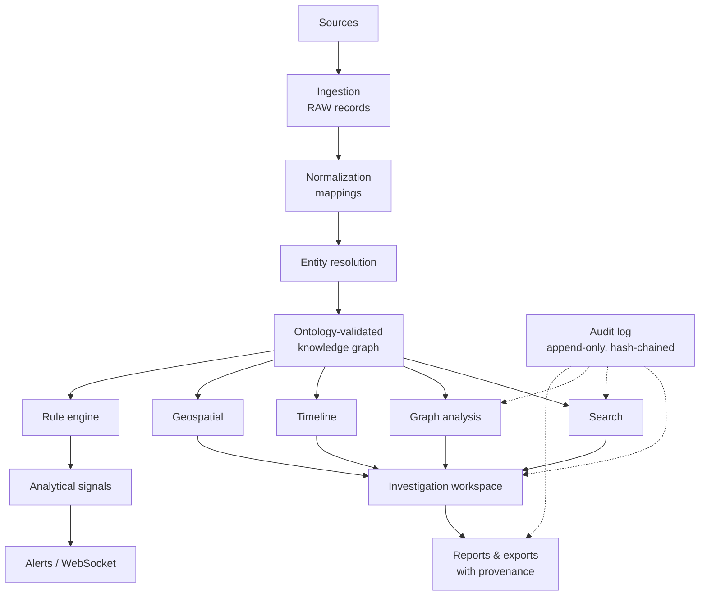

# Tessera — Architecture

Tessera is an original, local-first investigative-intelligence and decision-support
platform. It answers one question:

> *Given many heterogeneous data sources, what entities, relationships, events,
> locations and temporal patterns are connected to the question I am investigating?*

It is independently designed. It contains no third-party proprietary code, UI assets,
branding, algorithms or APIs, and it does not claim compatibility with any commercial
product.

## 1. System diagram

```
                ┌───────────────────────────────────────────────────────────────────────┐
 DATA SOURCES   │ CSV · JSON · JSONL · Parquet · PostgreSQL · REST APIs                   │
                └───────────────┬───────────────────────────────────────────────────────┘
                                │  Connector.iter_records() → RawRecord(source_record_id, payload)
                                ▼
 INGESTION      ┌──────────────────────────────┐   source_records (RAW, content-hashed, idempotent)
                │ app/ingestion/pipeline.py    │── ingestion_runs (transformation_version = mapping hash)
                └───────────────┬──────────────┘
                                │  declarative mapping (data/schemas/mappings.json)
                                ▼
 NORMALIZATION  ┌──────────────────────────────┐   deterministic ids, normalised identifiers,
                │ app/ingestion/mapping.py     │   ontology validation, coordinate checks
                └───────────────┬──────────────┘
                                ▼
 ENTITY         ┌──────────────────────────────┐   blocking → Jaro-Winkler / Levenshtein / token overlap
 RESOLUTION     │ app/entity_resolution/       │   → MATCH (reversible merge) · POSSIBLE_MATCH (review)
                └───────────────┬──────────────┘   · NO_MATCH — every decision carries its evidence
                                ▼
 ONTOLOGY       ┌──────────────────────────────┐   configurable types, properties, sensitivity,
                │ data/schemas/ontology.json   │   identifier kinds, relationship constraints
                └───────────────┬──────────────┘
                                ▼
 KNOWLEDGE      ┌──────────────────────────────────────────────────────────────────────┐
 GRAPH          │ PostgreSQL 16 + PostGIS 3.4                                           │
                │ entities · relationships · events · lineage_links · entity_identifiers │
                └───────┬──────────────────────────────┬───────────────────────────────┘
                        ▼                              ▼
 SEARCH  app/search/ (parser + pg_trgm)     GRAPH ANALYSIS  app/graph/ (SQL windowing + NetworkX)
                        │                              │
                        └──────────────┬───────────────┘
                                       ▼
 INVESTIGATION   investigations · evidence board · assertions · saved queries · rules/signals/alerts
 WORKSPACE       timeline · map (PostGIS) · graph · tables · provenance · reports · exports
                                       │
                         REST (FastAPI) + WebSocket (/ws)
                                       │
                 React + TypeScript workbench (Cytoscape · MapLibre · ECharts)
```



## 2. Epistemic model (the central design rule)

Every stored object carries an `epistemic_status`. The platform never collapses these:

| Status | Produced by | Example | UI treatment |
|---|---|---|---|
| `RAW` | connectors | a CSV row as received | grey badge, payload shown only to PII-cleared roles |
| `DERIVED` | versioned mappings | `Account —OWNS→` edge from a banking row | blue badge |
| `SYSTEM_INFERENCE` | ER, rules, analytics | ER merge, analytical signal | amber, dashed edges, "INFERENCE" |
| `ANALYST_ASSERTION` | people | "Entity A may be associated with Entity B" | violet, dotted, "HYPOTHESIS" |
| `VERIFIED` | authorised review of a DERIVED fact | investigator verifies an edge | green; original status kept in history |

* Analyst assertions live in their own table and can never change a source-derived record.
  Their statuses are `HYPOTHESIS → SUPPORTED / REFUTED / WITHDRAWN`; there is no path to `VERIFIED`.
* Rules and graph algorithms produce **ANALYTICAL SIGNALS**, never verdicts. Rule text that
  encodes a conclusion ("fraud", "guilty", …) is rejected at rule-definition time.
* Every signal answers: *what happened · why it was shown · which data supports it · when the
  data was collected · assumptions · what is uncertain · alternative explanations*.

## 3. Data model (PostgreSQL)

| Table | Purpose | Key indexes |
|---|---|---|
| `data_sources` | registered sources; secrets Fernet-encrypted (`secret_encrypted`) | pk |
| `ingestion_runs` | one row per run with `transformation_version` and stats | source_id |
| `source_records` | RAW payload, `content_hash`, `(source_id, source_record_id)` unique | source_id, record_type |
| `entities` | typed nodes, JSONB `properties`, `source_ids[]`, `geom geography(Point)`, `observed_at`, `merged_into` | type, GIN trigram `search_text`, GIN `source_ids`, GIN `properties`, GiST `geom`, `observed_at`, partial `(type,id)` live |
| `entity_identifiers` | normalised strong identifiers (email, phone, ip, account, natural key …) | `(kind, value)` |
| `relationships` | typed edges with `timestamp`, `confidence`, `source_records[]`, `provenance`, `analyst_modifications` | `(source_id,type)`, `(target_id,type)`, partial live `(source_id,type,timestamp)` / `(target_id,…)`, `type`, `timestamp`, GIN `source_records` |
| `events` | time-stamped happenings with `entity_ids[]`, `geom`, `source` | `timestamp`, `(event_type,timestamp)`, GIN `entity_ids`, GiST `geom` |
| `lineage_links` | `child ← parent` hops with transformation + version | `(child_kind,child_id)`, `(parent_kind,parent_id)` |
| `resolution_candidates` | ER decisions + evidence + review status | pair unique, decision |
| `geofences` | named polygons (`geography(Polygon)`) | GiST |
| `investigations`, `investigation_items` | workspaces, evidence board (with provenance snapshots) | `(investigation_id, kind)` |
| `assertions`, `saved_queries` | hypotheses, persisted queries | investigation_id |
| `rules`, `signals`, `alerts` | deterministic rules, their signals (fingerprinted, idempotent), alerts | GIN `entity_ids` / `entities` |
| `users`, `user_sessions` | accounts, server-side sessions (revocable) | username |
| `audit_log` | append-only (DB trigger), SHA-256 hash chain | ts, `(action, ts)`, `(object_type, object_id)` |
| `deletion_requests` | privacy erasure workflow (four-eyes) | entity_id |

Schema is managed by Alembic (`backend/migrations`). A test asserts autogenerate finds **no
diff** between models and migrations.

## 4. Lineage & provenance

```
transactions.parquet row TX-0000928            (source_records, RAW, content_hash)
   │  mapping:transaction map-1.0+4a2dcbb6     (lineage_links rows)
   ├──▶ entity  tran_…   (Transaction, DERIVED)
   ├──▶ relationship rel_… (INITIATED / TRANSFERRED_TO / LOCATED_AT / CONNECTED_TO)
   └──▶ event   evt_…    (transaction)
entity_resolution.merge er-1.2.0  (entity ← entity, with the full match evidence and a reversible move-log)
```

`GET /api/provenance/{id}` works for any object id and returns the *why* sentence, the source
records (source, record id, ingestion timestamp, transformation version, hash, payload for
cleared roles), upstream and downstream lineage graphs, ER history and analyst modifications.

## 5. Graph at scale (never the whole graph in the browser)

* **Storage**: adjacency lives in PostgreSQL; Neo4j is not required.
* **Traversal** (`app/graph/store.py`): hop-by-hop BFS; each hop is one indexed
  `source_id = ANY(:frontier) UNION ALL target_id = ANY(:frontier)` query with a
  `row_number()` **per-node fan-out cap** and a **global node budget**. Truncation is reported
  (`truncated`, `truncation_reasons`) and surfaced in the UI as "Partial view".
* **Paths** (`app/graph/paths.py`): bidirectional frontier expansion in SQL until the frontiers
  meet, then exact NetworkX algorithms on that bounded window: shortest, all-simple (limited),
  weighted (Dijkstra with `-ln(confidence)`), and relationship-constrained / direction-respecting.
* **Analytics** (`app/graph/analytics.py`): degree, betweenness (exact ≤1500 nodes else sampled),
  PageRank, weak/strong components, Louvain communities, k-core, bounded cycle detection,
  shortest-path statistics — all run on windows and labelled ANALYTICAL SIGNAL.
* **Caching**: deterministic reads (subgraph, analytics, search) are cached in Redis keyed by a
  global *data version* that every graph-changing write bumps, so stale results are never served.
* **Pagination / windowing** everywhere: entity lists, relationship lists, timelines, search,
  geo results, audit.

## 6. Geospatial

PostGIS `geography` columns with GiST indexes. Radius (`ST_DWithin`), polygon / line
intersection (`ST_Intersects` on validated GeoJSON), index-assisted KNN (`<->`), geofences,
trajectories, grid heatmaps/clusters (`ST_SnapToGrid`). `POST /api/geo/query` combines
**time × location × entity type × relationship** in one call. The map UI ships a fully offline
basemap (graticule) and can use any self-hosted MapLibre style via `VITE_MAP_STYLE_URL`.

## 7. Security architecture (see SECURITY.md)

bcrypt (SHA-256 pre-hash) passwords, lockout, JWT (HS256, 60 min) bound to **server-side
sessions** (revocable, idle timeout; role always re-read from DB), RBAC with explicit
permissions, field-level masking from ontology sensitivity, parameterised SQL only,
validated identifiers for dynamic table/column names, request size and NUL-byte guards,
rate limiting (Redis), security headers, append-only hash-chained audit log, Fernet-encrypted
source secrets, four-eyes deletion workflow, retention reporting/redaction.

## 8. AI boundary

The core contains no LLMs, agents, embeddings or generative summaries. A future assistant can
be added as a *client* of the existing REST API (search, graph, provenance, query builder)
with its outputs stored as `SYSTEM_INFERENCE` or `ANALYST_ASSERTION`, never as facts. No core
module imports or depends on such a component.

## 9. Observability

Structured JSON logs with request id and user; `x-request-id` / `x-response-time-ms` headers;
Prometheus metrics at `/metrics` (HTTP counts/latency by route, DB statement latency by
operation, graph operations, alerts); slow-statement log (>500 ms); in-process error ring buffer
(`GET /api/system/errors`, ADMIN); `/health` (liveness) and `/ready` (DB, PostGIS, migration
revision, Redis).

## 10. Repository layout

```
gotham_like/
├── backend/app/{api,models,schemas,services,ontology,graph,entity_resolution,ingestion,provenance,rules,auth,audit,privacy,search}
├── backend/migrations/           Alembic (0001 schema, 0002 audit trigger + partial indexes)
├── backend/tests/{unit,integration,security,performance}
├── frontend/src/{api,components,pages,graph,map,timeline,search,investigations,query,state}
├── frontend/tests/{unit,e2e}
├── data/schemas/                 ontology.json · mappings.json · sources.json · rules.json
├── data/synthetic/               generated SYNTHETIC / DEMONSTRATION DATA
├── scripts/                      generate_synthetic · seed_demo · demo_investigation · benchmark · verify_all.sh …
├── docs/                         this file, API, SECURITY, ONTOLOGY, BENCHMARKS, examples/
└── docker/                       Dockerfiles, compose, nginx
```
